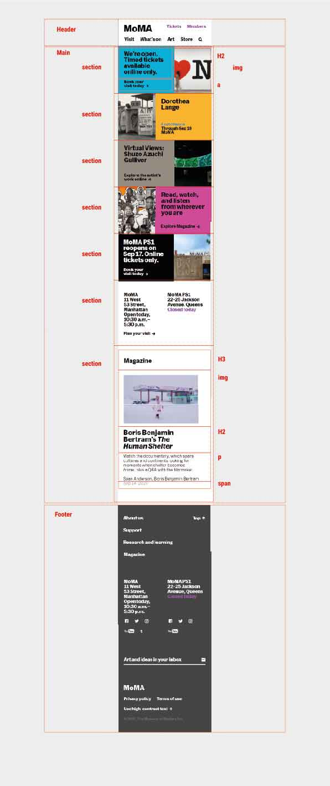

# Frontend - project web
Auteur: Chris
Frontend 2 repository voor mijn website
### Startniveau Frontend 2 - Rode Piste
Startniveau is iets bovengemiddeld denk ik, dus rode piste. Ik heb als stage ook gewerkt met veel frontend en bij mijn minor virtual reality ook wat geprogrammeerd hier en daar. Natuurlijk als herkanser zijn wat aspecten ook herhaling. Hier tegenover denk ik ook dat ik redelijk wat moet opfrissen en weer een beetje in die developer mindset moet komen. 
### Welke website ga ik maken?
Ik ga de site van MoMA namaken. 
### Responsive of meer aandacht surface
Ik wil in eerste instantie meer leren over fancy animaties en typografie en meer een visuele ervaring maken. Mocht ik nog tijd hebben dan wil ik het zeker graag responsive maken voor een hoger cijfer. 
### Welke pagina's ga ik namaken?
Ik ga de homepagina en de collectie pagina maken. 
### breakdown schets


## Week 1
#### WG1
Links naar codepen opdrachten: 
Opdracht 1: https://codepen.io/chriskes/pen/KKzyyGp
Opdracht 2: https://codepen.io/chriskes/pen/abNVVQw
## Week 2
#### WG2
Links naar codepen opdrachten: 
Opdracht 1: https://codepen.io/chriskes/pen/PoNEyxm
Opdracht 2: https://codepen.io/chriskes/pen/qBZxrLK?editors=1100
#### WG3
Flexbox Froggy gedaan, laatste level was best lastig. De truc was met flex-wrap, de wrap-reverse te gebruiken. 
```css
flex-flow:column-reverse wrap-reverse;
justify-content:center;
align-content:space-between;
```
## Week 3
#### WG4
Opdracht 1: https://codepen.io/chriskes/pen/qBZyBvG
Opdracht 2: https://codepen.io/chriskes/pen/vYGaYMO
#### WG5 *feedback*
- De header kan geheel met flex-box. Hoe het nu is met "nav-upper" en "nav-lower" zijn niet echt descriptive classes, dus probeer dat te vermijden. Het onderste deel is de header en het deel met de logo en de 2 links kan een section zijn. 
- SVG niet al img's inladen maar echt apart als SVG's kijk of hier tijd voor is anders gebruik .png
- Eerst knopjes werkend van form, en hele nette html. Daarop haal je sneller voldoende.  Beter robuste html form dan fancy vormgegeven. 
- Top button in footer met # easy win interactiehttps://www.w3schools.com/cssref/pr_scroll-behavior.asp > easy win en heel fancy 
